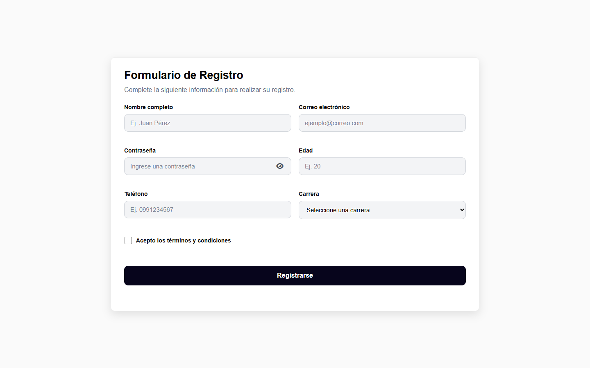
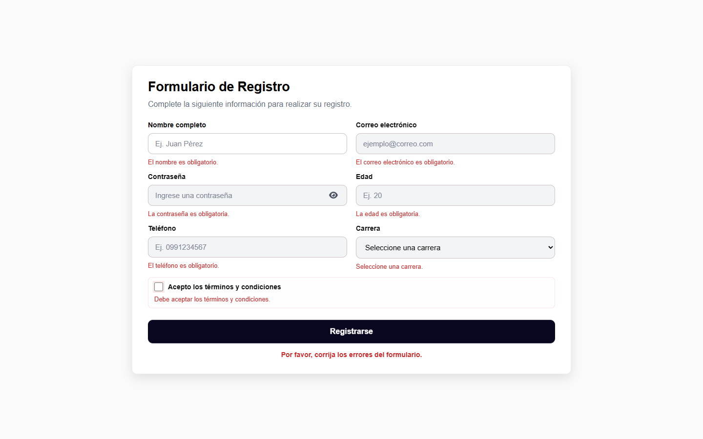

# Formulario de Registro

Formulario web responsivo desarrollado con HTML, CSS y JavaScript. Incluye validaciones del lado del cliente, mensajes de error y una interfaz adaptable a computadoras y dispositivos móviles.

## Vista del proyecto

### Escritorio

Los campos se organizan en dos columnas para aprovechar el espacio y mostrar el formulario completo.



### Validaciones

Cada campo incorrecto se resalta y presenta un mensaje que indica cómo corregirlo.



### Dispositivo móvil

En pantallas pequeñas, los campos se acomodan en una sola columna para facilitar su uso.


## Funcionalidades

- Validación en tiempo real mediante los eventos `input`, `blur`, `change` y `submit`.
- Mensajes específicos para cada campo incorrecto.
- Prevención del envío mientras existan datos inválidos.
- Opción para mostrar u ocultar la contraseña con Font Awesome.
- Enfoque automático en el primer campo con errores.
- Limpieza del formulario después de un registro correcto.
- Diseño de dos columnas en escritorio y una columna en móviles.
- Atributos de accesibilidad y autocompletado.

## Validaciones

| Campo | Condición |
| --- | --- |
| Nombre | Obligatorio y mínimo de 3 caracteres. |
| Correo | Obligatorio y con formato válido. |
| Contraseña | Obligatoria y mínimo de 8 caracteres. |
| Edad | Valor entre 18 y 100 años. |
| Teléfono | Exactamente 10 números. |
| Carrera | Selección obligatoria. |
| Términos | Aceptación obligatoria. |

## Tecnologías

- HTML5
- CSS3 y CSS Grid
- JavaScript
- Font Awesome

## Estructura

```text
formulario_registro_web/
|-- assets/
|   `-- capturas/
|       |-- formulario-escritorio.png
|       |-- formulario-movil.png
|       `-- formulario-validaciones.png
|-- css/
|   `-- styles.css
|-- js/
|   `-- script.js
|-- index.html
`-- README.md
```

## Formulario en línea

El proyecto se encuentra publicado y puede probarse directamente desde el navegador:

[Abrir el formulario en GitHub Pages](https://gabrielhasqui.github.io/formulario_registro_web/)
