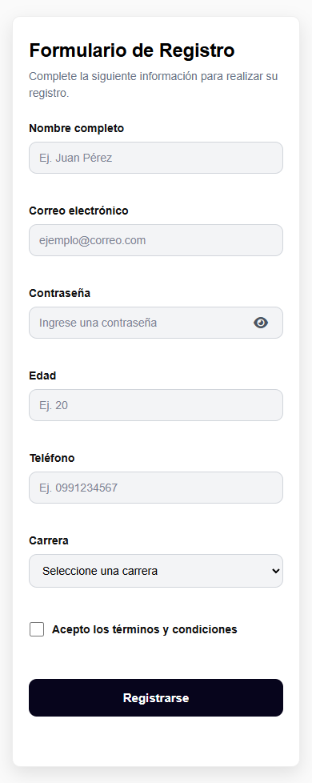

# Formulario de Registro

Formulario web responsivo desarrollado con HTML5, CSS y JavaScript. El proyecto valida los datos directamente en el navegador, proporciona mensajes claros al usuario y adapta su distribución a diferentes tamaños de pantalla.

Este trabajo fue realizado como práctica de desarrollo web del lado del cliente, aplicando estructura semántica, estilos responsivos, manipulación del DOM y validaciones con JavaScript.

## Vista del proyecto

### Escritorio

En pantallas amplias, los campos se organizan en dos columnas para aprovechar el espacio disponible y evitar desplazamientos innecesarios.


### Validaciones

Cuando existe información incorrecta o incompleta, el formulario identifica cada campo, muestra su respectivo mensaje y enfoca el primer dato que debe corregirse.


### Dispositivos móviles

En pantallas pequeñas, el formulario cambia automáticamente a una sola columna para mantener la legibilidad y facilitar la interacción.



## Funcionalidades

- Registro mediante nombre, correo electrónico, contraseña, edad, teléfono y carrera.
- Aceptación obligatoria de términos y condiciones.
- Validación inmediata mediante los eventos `input`, `blur`, `change` y `submit`.
- Mensajes específicos de error para cada campo.
- Confirmación visual cuando los datos son correctos.
- Prevención del envío mientras existan datos inválidos.
- Botón con iconos de Font Awesome para mostrar u ocultar la contraseña.
- Enfoque automático en el primer campo incorrecto.
- Limpieza del formulario después de un registro exitoso.
- Diseño responsivo de dos columnas en escritorio y una columna en móviles.

## Validaciones implementadas

| Campo | Validación |
| --- | --- |
| Nombre completo | Obligatorio y mínimo de 3 caracteres. |
| Correo electrónico | Obligatorio y con estructura de correo válida. |
| Contraseña | Obligatoria y mínimo de 8 caracteres. |
| Edad | Obligatoria y comprendida entre 18 y 100 años. |
| Teléfono | Obligatorio y formado por exactamente 10 números. |
| Carrera | Es obligatorio seleccionar una opción. |
| Términos | Deben aceptarse antes de completar el registro. |

## Tecnologías utilizadas

- **HTML5:** estructura del formulario y atributos de validación.
- **CSS3:** diseño visual, estados de los campos, CSS Grid y adaptación móvil.
- **JavaScript:** validaciones, eventos y manipulación del DOM.
- **Font Awesome:** iconos para mostrar y ocultar la contraseña.

No se utilizaron frameworks ni librerías de JavaScript. Font Awesome se carga mediante CDN exclusivamente para los iconos.

## Estructura del proyecto

```text
Formulario Desarrollo Web/
|-- assets/
|   `-- screenshots/
|       |-- formulario-escritorio.png
|       |-- formulario-movil.png
|       `-- formulario-validaciones.png
|-- index.html
|-- styles.css
|-- script.js
`-- README.md
```

## Ejecución local

El proyecto no necesita instalación ni compilación.

1. Descarga o clona el repositorio.
2. Abre la carpeta del proyecto.
3. Abre `index.html` en un navegador moderno.

También puede ejecutarse con la extensión **Live Server** de Visual Studio Code:

1. Abre el proyecto en Visual Studio Code.
2. Haz clic derecho sobre `index.html`.
3. Selecciona **Open with Live Server**.

## Diseño responsivo

La versión de escritorio utiliza CSS Grid para mostrar los campos en dos columnas. Cuando el ancho de la pantalla es menor o igual a `700px`, una media query cambia la distribución a una sola columna.

Esta organización permite que el formulario se vea completo en una pantalla de escritorio convencional y continúe siendo fácil de utilizar en teléfonos.

## Accesibilidad y experiencia de usuario

- Todos los campos tienen etiquetas asociadas mediante `label` y `for`.
- Los mensajes de error se relacionan con sus campos mediante `aria-describedby`.
- El mensaje general utiliza `aria-live` para anunciar cambios.
- El control de contraseña mantiene actualizado su `aria-label` y su estado `aria-pressed`.
- Los campos incluyen atributos de autocompletado cuando corresponde.
- Los estados correctos e incorrectos se diferencian visualmente.
- La navegación y el envío pueden realizarse utilizando el teclado.

## Flujo del formulario

1. El usuario completa los campos.
2. JavaScript valida cada dato durante la escritura o al abandonar el campo.
3. Al presionar **Registrarse**, se vuelven a comprobar todos los valores.
4. Si existen errores, se muestran los mensajes y se enfoca el primer campo inválido.
5. Si todos los datos son correctos, se muestra una confirmación y el formulario se limpia.

## Alcance

El proyecto demuestra validaciones del lado del cliente. No utiliza base de datos ni envía información a un servidor, ya que estas funcionalidades no forman parte del objetivo de la práctica.

## Requisitos cubiertos

- Estructura HTML5 con `form`, `label`, `input`, `select` y `button`.
- Más de cinco campos de diferentes tipos.
- Uso de `required`, `placeholder`, `min`, `max`, `minlength`, `maxlength` y `pattern`.
- Archivo CSS externo con tipografía, colores, bordes, espaciados y botones.
- Uso de CSS Grid y diseño adaptable.
- Archivo JavaScript externo y manipulación del DOM.
- Eventos `input`, `blur`, `change` y `submit`.
- Validación de campos obligatorios, correo, contraseña, datos numéricos y teléfono.
- Mensajes de error y éxito.
- Bloqueo del envío cuando existen datos inválidos.

## Autoría

Proyecto académico desarrollado para la asignatura de Desarrollo Web.
